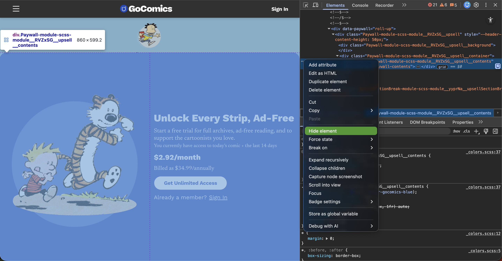
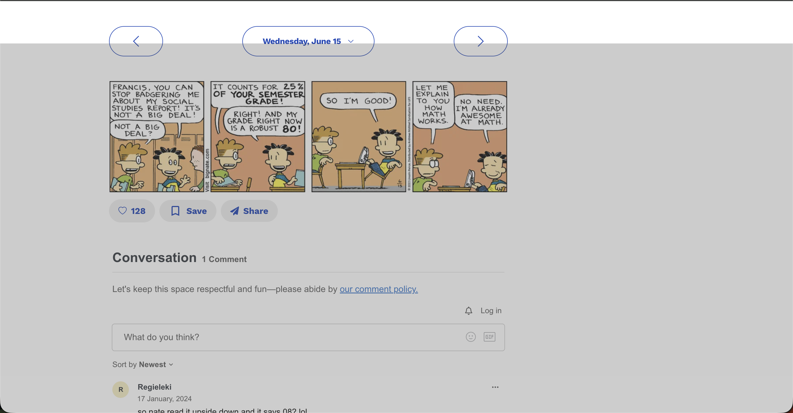

# GoComics UX Patch

## 🚀 Quick Start
For those who just want to test the patch immediately, you can find the raw script here: 
👉 **[patch.js](./patch.js)**

### How to use:
1. Copy the code from `patch.js`.
2. Open **GoComics** in your browser.
3. Open the Developer Console (`F12` or `Cmd+Option+J`).
4. Paste the code and hit **Enter**.

---
## The Problem:
One of my favorite comic strips is **Big Nate**, and seeing that it was finals week and I should be studying, I decided it was peak time to re-read some strips. 

However, my usual website, GoComics, had implemented a paywall during my absence, and there seemed to be no good alternative other than downloading all 35 years of comic strips. Similarly, all hacks I found online seemed to have been patched as well.

So, I decided to tackle the problem myself. I started where all frontend debugging begins: the **DOM**.

---

## Attempt #1: The "Delete" Method
Using inspect elements, I identified the paywall element. I first tried the easiest hack: hiding the element or deleting the node manually. 

**The Result:** While this worked for a split second, the pop-up would reappear immediately. This is likely because the site uses a **MutationObserver** or a "watcher" element that monitors the DOM. By removing the element, I triggered the watcher, which simply re-rendered the paywall.


*Trying to hide the element manually*

---

## Attempt #2: The Interval War
Next, I attempted to automate the "hide" command. I wrote a script that would scan the DOM every 100ms and force `display: none` on the paywall.

**The Result:** This led to a "gray box" flickering effect. My browser eventually froze as the site's watcher and my script entered a high-frequency execution war, maxing out the CPU cycles of the tab. I couldn't beat the watcher by fighting it; I had to trick it.


*A gray box appeared that made me unable to interact with the elements behind it*

---

## Final Attempt: The "Shrink-Ray" Strategy
Finally, I decided to change my approach. Instead of trying to remove the paywall, I would make it so small that it wouldn't interfere at all but still "exist" so the watcher wouldn't go haywire. 

To understand why this works, we have to look at two concepts: **CSS Specificity** and **Scroll Restoration.**

### 1. The CSS Specificity "Point System"
CSS isn't just a list of rules; it's a hierarchy. When two rules conflict, the browser uses a scoring system to decide which one wins. By using **Attribute Selectors** and the `!important` flag, we can override the site's default styles regardless of how they generate their class names.

| Selector Type | Example | Points | Notes |
| :--- | :--- | :--- | :--- |
| **Element** | `div` | 1 | Lowest priority. |
| **Class** | `.Paywall-module` | 10 | Standard styling. |
| **Attribute** | `[class*="Paywall-"]` | 10 | Our strategy: Targets dynamic hashes. |
| **ID** | `#paywall-root` | 100 | Very strong. |
| **Inline Style** | `style="display:block"`| 1000 | Overridden only by `!important`. |

In the case where there's a tiebreaker, the DOM breaks tiebreaks based on the last inputted rule. So in this scenario this is what it came down to:

| Source | Selector | Specificity | Priority |
| :--- | :--- | :--- | :--- |
| **GoComics CSS** | `.Paywall-module...` | 10 pts | 1st (Overridden) |
| **My Injected Patch**| `[class*="Paywall-"]` | 10 pts | **2nd (Winner)** |

Because my script appends the new style block to the bottom of the `<head>` *after* the site has already loaded its own styles, my "Zero-Dimension" rule takes precedence. I don't need to out-score their points; I just need to be the last one to speak.

### 2. Breaking the Scroll Lock
Many modern UIs lock the `<body>` scroll when a modal triggers by setting `overflow: hidden`. Even if you hide the paywall, the browser's scroll-engine remains disabled. My patch forces the environment back to its natural state.

---

## The Solution
By targeting the **SCSS modules** with a wildcard selector and injecting it as the final element in the `<head>`, I strip the paywall of its dimensions while keeping the node "alive" to avoid triggering the watcher.


```javascript
// To use this, simply paste it into the console
(function() {
    const style = document.createElement('style');
    style.id = 'ux-cleanup-patch'; 
    
    style.innerHTML = `
        [class*="Paywall-module-scss-module__"]{

            height: 0;
            width: 0;

        }


        /* RESET THE ENVIRONMENT:
           Many reactive UIs lock the <body> scroll when a modal triggers.
           We force 'overflow: auto' to restore user control. */
        body, html {
            overflow: auto !important;
        }
    `;

    // Inject into the <head> to ensure it sits at the end of the cascade
    document.head.appendChild(style);

    console.log("------------------------------------------");
    console.log("UX Patch Applied Successfully.");
    console.log("Strategy: Chained Attribute Specificity (20pts)");
    console.log("------------------------------------------");
})();
```

Now, back to studying for finals (or maybe just one more Big Nate strip).
